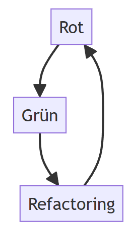

# Einheit 04:  C4 Software Dokumentation

##

## Lernziele

**Probleme** bei der Dokumentation von Software-Architekturen **verstehen**&#x20;

Die **vier Ebenen** des C4-Models **kennen**

Das C4 Modell auf Problemstellungen **anwenden können**

Software-Architekturen mit Hilfe des C4-Models **dokumentieren und kommunizieren können**

## Probleme bei der Dokumentation

Welches ist die beste/einfachste/verständlichste Art Software-Architekturen zu dokumentieren

So? Schnell und einfach aber klar und verständlich?

<figure><figcaption>
Quelle: http://c4model.com/
</figcaption></figure>

Besser so? Formal ja, aber genügend Detailgrad und unmißverständlich?

<figure><figcaption></figcaption></figure>

Noch besser so? Formal ja, mehr Detailgrad, aber genug Implementierungsetails? Was bedeuten die Pfeile?

<figure><figcaption></figcaption></figure>

Oder seher so? Autoamtisiert ja, aber klar und verständlich?&#x20;

<figure><figcaption></figcaption></figure>

Vielleicht aber doch so:&#x20;

<figure><figcaption>
Twitter Architektur Zeichnung von Elon Musk, annotiert von Justin Hendrix, Luke Dubois and Mark Hansen. Original Miro board: <a href="https://miro.com/app/board/uXjVPBnTJmM=/">https://miro.com/app/board/uXjVPBnTJmM=/</a>
</figcaption></figure>

Ganz oft dann aber auch so, weil einfach und handhabbar und nicht formal:&#x20;

<figure><figcaption></figcaption></figure>

**Problem formaler Methoden**: Diese sind "synthetisch" und müssen gelernt werden. Sie müssen von beiden Seiten verstande n werden. Daher einigt man ich meistens pragmatisch auf die Ebene, die beide Seiten verstehen.&#x20;

## Übung

**Teil 1:**

* Finden Sie sich in Ihrer Gruppe zusammen
* Stellen Sie sich kurz gegenseitig jeweils das größte Software-Projekt vor, an dem Sie bisher gearbeitet haben und wählen Sie in Ihrer Gruppe ein Projekt aus erklären Sie die Architektur des Projektes dem Rest Ihres Teams.&#x20;
* Dauer 10 Minuten.

**Teil 2:**&#x20;

* Ein Team-Mitglied, von dem das Projekt **nicht eingebracht wurde**, stellt die Architektur nun dem gesamten Kurs vor.
* Dauer 5 Minuten.

**Teil 3:**

* Kurze Feedback Runde
* Dauer 5 Minuten&#x20;

## Motivation

Visuelle Kommunikation im Baugewerbe: Hier gibt es Lageplane, Raumpläne, Bebauungspläne, Querschnittsansichten, detaillierte Standardzeichnungen und technische Zeichnungen, die von den ausführenden Gewerken in der Regel ohne Probleme gelsen und (fehlerfrei) umgesetzt werden können.&#x20;

<figure><figcaption>
Querschnittsansicht
</figcaption></figure>

<figure><figcaption>
Raumplan
</figcaption></figure>

<figure><figcaption>
Elektroninstallation
</figcaption></figure>

Wie sieht hingegen die Kommunikation in Software-Projekten aus?&#x20;

<figure><figcaption></figcaption></figure>

* Durcheinander von Boxen und Linien&#x20;
* Inkonsistente Notationen, Farben, Formen und Linien&#x20;
* Mehrdeutige Bezeichnungen
* Beziehungen nicht benannt
* Fehlende Technologieentscheidungen und Details
* Vermischte Abstraktionslevel

Aufgrund der Bewegung hin zu agilen Methoden wird weniger "Up Front Design" durchgeführt und es finden sich weniger Software-Diagramme in agilen Projekten.&#x20;

Wenn Diagramme genutzt werden sind diese oftmals&#x20;

* Unklar
* Mehrdeutig
* Verwirrend
* und haben vermischte Detailgrade

## C4 Modell&#x20;

Das [C4 Modell](https://c4model.com) nutzt so.g Code-Landkarten zum verschiedene Sichten auf eine Software-Architektur zu modellieren. Jede Sicht kann für einen ganz unterschiedlichen Zweck und eine unterschiedliche Zielgruppe genutzt werden.

**Context**

<figure><figcaption>
Bildquelle https://maps.google.com
</figcaption></figure>

In welchem Gesamtkontext befindet sich das System, an welche externen Systeme grenzt es an?

**Container**

<figure><figcaption>
Bildquelle https://maps.google.com
</figcaption></figure>

Aus welchen Bestandeilen besteht das System.

**Component**

<figure><figcaption>
Bildquelle https://maps.google.com
</figcaption></figure>

Wie sind die einzelnen Bestandteile aufgebaut.&#x20;

**Code**

<figure><figcaption>
Bildquelle Peter Schmelzle - Self-photographed, CC BY-SA 3.0
</figcaption></figure>

Wie sehen die Bestandtiel des Systems im Detil aus.&#x20;
