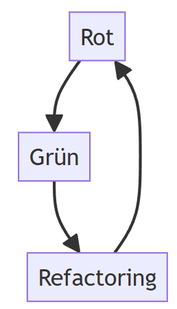

# Einheit 7: TDD und MOCKs

## Ziele

* Grundlegendes Verständnis für TDD, Code Katas und Mocking-Frameworks
* Praktische Anwendung aller drei Konzepte

## Motivation


Die Nutzung von **Test-Driven Development** (TDD), Code Katas und Mocking-Frameworks kann die Qualität und Effizienz der Softwareentwicklung steigern. TDD zwingt einen dazu, zuerst Tests zu schreiben, bevor Code geschrieben wird, was dazu führt, dass es von Anfang an klare Anforderungen an den Code gibt.

**Code Katas** bieten die Möglichkeit, diese Fähigkeiten zu verbessern, indem wiederholt kleine Übungsprobleme gelöst werde.

**Mocking-Frameworks** ermöglichen es, isolierte Tests für einzelne Komponenten zu schreiben, was die Fehlererkennung und -behebung erleichtert. Durch die Kombination dieser Praktiken wird die Entwicklung agiler und robuster.\


## TDD

> All Code is guilty, until proven innocent.

**Test Driven Development** ist ein Technik, in dem Tests vor dem Code geschrieben werden um diese zu validieren.

> Validierung: Tut der Code das richtige.

Voraussetzung: Kurze bzw. schnelle Zyklen bei der Entwicklung und dem Testen. Hierfür macht es Sinn Unit Test Frameworks zu nutzen.

### Genereller Ablauf

1. Test schreiben - Der Test soll die gewünschte Funktionalität abdecken.
2. Test ausführen. Sicherstellen, dass der neue Test fehlschlägt (=rot🔴)
3. Code schreiben, so dass der Test ohne Fehler durchlaufen wird. Nicht mehr, nicht weniger.
4. Test ausführen. Ist der Test noch rot? Zurück zu 3. und Code so anpassen, so dass der Test ohne Fehler durchlaufen wird. Ist der Test durchgelaufen (=grün 🟢)? Dann zu 5. weiter.
5. Code Refactoring.
6. Weiter mit Schritt 1.

<figure><figcaption></figcaption></figure>

1. **Red –** Test erstellen, der fehlschlägt
2. **Green –** Test läuft ohne Fehler durch
3. **Refactor –** Da jetzt alle Tests (einschl. des neuen Tests) grün sind, kann der Code refactored werden.

### Übung

**TDD für Primzahlen**

Eine Zahl gilt dann als Primzahl, wenn sie folgende Bedingungen erfüllt:

* Sie ist natürlich, also größer als 1 und ganz (ohne Nachkommastellen) Sie lässt sich ganzzahlig (d.h. ohne Rest) nur durch 1 und sich selbst teilen.

#### Aufgabe

Das Tutorial soweit durcharbeiten, bis die gezeigte Ausgabe zu sehen ist.

#### Voraussetzungen

* Erforderlich:
  * Visual Studio Code
  * C# (Extension für VS Code)
* Empfohlen
  * .NET Extension Pack (Extension für VS Code)
  * .C# Dev Kit (Extension für VS Code)
  * .NET Install Tool (Extension für VS Code)

.NET Solution erstellen:

```
dotnet new sln -o seks-tdd  
```

In den Ordner wechseln und eine Klassenbibliothek erstellen:

```
dotnet new classlib -o PrimeService
```

_Class1_ in _PrimeService_ umbenennen

```
namespace Prime.Services;
public class PrimeService
{
}
```

Im _seks-tdd_ Ordner die Klassenbibliothek hinzufügen

```
dotnet sln add ./PrimeService/PrimeService.csproj
```

Das Testprojekt erstellen

```
dotnet new xunit -o PrimeService.Tests
```

Das Testprojekt zur Solution hinzufügen:

```
dotnet sln add ./PrimeService.Tests/PrimeService.Tests.csproj
```

Zum Abschluss noch die _PrimeService_ Klassenbibliothek dem Testprojekt als Referenz hinzufügen:

```
dotnet add ./PrimeService.Tests/PrimeService.Tests.csproj reference ./PrimeService/PrimeService.csproj  
```

Den ersten Test schreiben

```
namespace Prime.Services.Tests;
public class PrimeServiceTest
{
    [Fact]
    public void TestOneIsPrime()
    {
        var primeService = new PrimeService();
        bool result = primeService.IsPrime(1);
        Assert.False(result, "1 should not be prime");
    }
}
```

Auf Konsole die Test starten:

```
dotnet test
```

Alle Probleme beheben und Code Implementieren.

Die _IsPrime_ Klasse sollte dann ungefähr so aussehen: #

```
namespace Prime.Services;
public class PrimeService
{
  public bool IsPrime(int candidate)
  {
    return false;
  }
}
```

Nun nochmal den Test starten (s.o.):

```
Die Testausführung wird gestartet, bitte warten...
Insgesamt 1 Testdateien stimmten mit dem angegebenen Muster überein.

Bestanden!   : Fehler:     0, erfolgreich:     1, übersprungen:     0, gesamt:     1, Dauer: < 1 ms - PrimeService.Tests.dll (net7.0)
```

\
Code Katas


Code Katas sind vorgegebene Programmieraufgaben. Die Idee wird erstmal 1999 in dem Buch "The Pragmatic Programmer" von David Thomas und Andrew Hunt erwähnt.

Dabei geht es nicht um die Lösung der Aufgabenstellung, sondern den Bearbeitungsweg. Im Vordergrund steht somit das Erlernen neuer Fertigkeiten:

* Umgang mit der IDE
* Nutzung der Kommandozeilentools
* Erlenen von Shortcuts
* Anwenden von Prinzipien im Software-Design
* Anwenden von Refactoring-Methoden
* ...

In der Regel werden Code Katas mittels TDD durchgeführt.

Je öfters Code Katas wiederholt werden, desto schneller (und leichter) kann man die Problemstellung lösen.

Da man sich bei den Wiederholungen weniger auf die Problem- bzw. Aufgabenstellung konzentrieren muss, werden die Abläufe um und während des Programmierens verbessert.

#### Code Kata Beispiel: FizzBuzz


**Aufgabenstellung**:

1. Schreibe eine Methode _fizzbuzz_, die eine Nummer als Eingabe akzeptiert und als String zurück liefert.
2. Für alle Vielfachen von Drei liefere _Fizz_ anstelle der Nummer.
3. Für alle Vielfachen von Fünf liefere _Buzz_ anstelle der Nummer.
4. Für alle Zahlen, die eine Vielfaches von drei als auch fünf sind liefere _FizzBuzz_ zurück.

Regeln:

* Es wird mit der minimalen Lösung gestartet, die fehlschlägt!
* In jeder Interration nur so viel Code schreiben, dass der nächste Test grün wird.
* Sobald der Test grün ist, wird der Code refactored.
* Überprüfungen (Assertions) im Test werden exakt entsprechend der Anforderungen formuliert.

**Links:**


* [A curated list of code katas (github.com)](https://github.com/gamontal/awesome-katas)
* [CodeKata.com](http://codekata.com/)
* [How to solve the Katas with TDD](https://tddmanifesto.com/exercises/)

#### Übung


Code Kata Fizzbuzz entweder mit .NET oder mit JavaScript durcharbeiten

**Variante A: .NET und C#**

Voraussetzungen wie ein erster Aufgabe.

**Variante B: JavaScript**

Erforderlich:

* [Node.js](https://nodejs.org/)
* [npm](https://www.npmjs.com/)
* [Chai](https://www.chaijs.com/)

Empfohlen:

* Visual Studio Code
* [nvm (for Windows)](https://github.com/coreybutler/nvm-windows)

## Mocking Frameworks


Mocking-Frameworks erlauben es sog. Mock-Objekte zu erstellen, die das Verhalten aufgerufener Objekte simulieren. Das kann sinnvoll sein, wenn z.B. ein Web Service , eine Datenbank oder allgemein Objekte aufgerufen werden, die im eigentlichen Test zwar benötigt werden, aber deren Verhalten in diesem Test nicht geprüft werden soll.

Das Mock-Objekt liefert dabei keine Echtdaten zurück, sondern vorher zum Testfall passend festgelegte Werte. Somit lässt sich leicht ein deterministisches Verhalten herbeiführen, da sich die aufgerufenen Objekte immer gleich verhalten.

Wie sich die Mock-Objekte verhalten sollen, wird am Anfang des jeweiligen Tests festgelegt.

Vor dem eigentlichen Test werden alle Objekte, die nicht benötigt werden ausgetauscht und durch die Mock-Objekte ersetzt (dahinter steht das Prinzip der Polymorphie in der OO-Entwicklung).


#### Übung


**NumberGenerator mit moq**


1. Einen Generator erstellen, der bei Eingabe einer ganzen Zahl die nächste Primzahl liefert.
2. Der Generator muss den zuvor entwickelten _PrimeService_ nutzen.
3. Trotz des noch nicht ausgereiften Zustands des _PrimeServices_, muss die Funktionsweise des Nummerngenerators sichergestellt werden.

In den Order mit dem ersten Testprojekt (1. Übung) wechseln:

```
dotnet add package Moq
```

Im Testprojekt eine neue Datei `NumberGeneratorTest.cs` anlegen:

```
namespace Prime.Services.Tests;
using Moq;

public class NumberGeneratorTest
{
}
```

Den Test erstellen:

```
[Fact]
public void GenerateNextPrimeTest()
{
  var numberGenerator = new NumberGenerator();
  int result = numberGenerator.GenerateNextPrime(9);
  Assert.Equal(11, result);
}
```

Im _PrimeService_ Projekt eine neue Datei `NumberGenerator.cs` anlegen

```
public class NumberGenerator
{
  IPrimeService _primeService = new PrimeService();
  public NumberGenerator(IPrimeService primeService)
  {
    _primeService = primeService;
  }

  public int GenerateNextPrime(int candidate)
  {
    while (!_primeService.IsPrime(++candidate))
    {
      //loop until we find a prime number
    };
    return candidate;
  }
}
```

Nun wird im Test Projekt ein Fehler erscheinen:

```
There is no argument given that corresponds to the required parameter 'primeService' of 'NumberGenerator.NumberGenerator(IPrimeService)
```

Den Test entsprechend abändern

```
[Fact]
public void GenerateNextPrimeTest()
{
  var primeServiceMock = new Mock<IPrimeService>();
  primeServiceMock.Setup(x => x.IsPrime(10)).Returns(false);
  primeServiceMock.Setup(x => x.IsPrime(11)).Returns(true);
  
  var numberGenerator = new numberGenerator(primeServiceMock.Object);
  int result = numberGenerator.GenerateNextPrime(9);
  Assert.Equal(11, result);
}
```

Nun nochmal den Test starten (s.o.):

```
Die Testausführung wird gestartet, bitte warten...
Insgesamt 1 Testdateien stimmten mit dem angegebenen Muster überein.

Bestanden!   : Fehler:     0, erfolgreich:     2, übersprungen:     0, gesamt:     2, Dauer: 51 ms - PrimeService.Tests.dll (net7.0)
```

**Links**


* [moq](https://github.com/devlooped/moq/)

### Voraussetzungen


* analog zu Übung 1 und Übung 2
* moq als Paket
