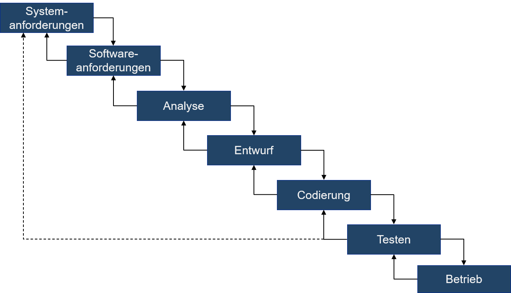

# Exkurs: Wasserfall Model

## Wasserfall

<figure><figcaption></figcaption></figure>

## Beispiel für Wasserfall Probleme

* In den Tests wird das erste Mal ersichtlich, dass eine Anforderung falsch verstanden wurde...
* Konsequenz
  * Kosten und Entwicklungszeit verdoppeln sich...
* Weiteres Problem
  * Keine Steuerung von Risikofaktoren

Gravierende Rückschritte durch späte Probleme\

<figure><figcaption></figcaption></figure>

## Warum Wasserfall?

Einge Geschichte unglücklicher Missverständnisse:

* Winston W. Royce (1929-1995), Informatiker und Direktor bei Lockheed Software Technology Center
* Paper [_Managing the Development of Large Software Systems_](http://leadinganswers.typepad.com/leading\_answers/files/original\_waterfall\_paper\_winston\_royce.pdf), 1970 Beschreibt den fehlerbehafteten und risikoreichen Prozess der Software-Entwicklung in den 1960ern

> I believe in this concept, but the implementation described above is risky and invites failure.

## Wasserfall Ursprung

* Der Prozess wurde als solcher nie von Royce propagiert
* Erstmals genannt im Paper von von Bell & Thayer, [_Software requirements: Are they really a problem?_](https://static.aminer.org/pdf/PDF/000/361/405/software\_requirements\_are\_they\_really\_a\_problem.pdf), 1976
* Aber 1986 im Department of Defense Standard 2167A ([DOD-STD-2167A](http://everyspec.com/DoD/DoD-STD/DOD-STD-2167A\_8470/)) als quasi Entwicklungsstandard für externe Entwicklungspartner eingeführt

> The same top-down approach to a series of requirements statements is explained, without the specialized military jargon, in an excellent paper by Royce ;he introduced the concept of the “waterfall” of development activities. In this approach software is developed in the disciplined sequence of activities shown in Figure I.

* Allerdings sieht DOD-STD-2167A vor, dass der Prozess iterativ ausgeführt werden kann, wodurch grundsötzlich auch eine agile Arbeitsweise möglich gewesen wäre.

> \[...] The Software development process shall include the follwing major activities, which may overlap and may be applied iteratively or recursively.

## Missverständnisse&#x20;

Das von Royce beschriebene Modell ist nicht so starr, wie oft angenommen. In den Ausführungen von Royce finden sich Konzepte, die sich heute in Agilen Methoden und DevOps-Ansätzen wiederfinden.

* DevOps: Entwicklung und Betrieb in einem Team

> There is first an analysis step, followed second by a coding step as depicted in Figure 1. This sort of very simple implementation concept is in fact all that is required if the effort is sufficiently small and if the final product is to be operated by those who built it

* Scrum: Iterative Entwicklung („Do it twice“)

> If the computer program in question is being developed for the first time, arrange matters so that the version finally delivered to the customer for operational deployment is actually the second version…

* Scrum: Involve the customer

> …points following requirements definition where the insight, judgment, and commitment of the customer carl bolster the development effort.

> It is important to involve the customer in a formal way so that he has committed himself at earlier points before final delivery.

> …also the kind of development effort for which most customers are happy to pay, since both steps \[Anm. Analyse u. Codierung] involve genuinely creative work which directly contributes to the usefulness of the final product.

Weiterhin schlägt Royce zahlreiche Reviews vor, um frühzeitig Feedback einzuholen:&#x20;

* Royce beschreibt in seinem Paper drei Reviews, die sich im »Wasserfallmodell« jedoch nicht finden
* **Preliminary Software Review**
  * Zeitpunkt: Nach vorläufigem Software Design
* **Critical Software Review**
  * Zeitpunkt: Nach dem Programm Design
* **Final Software Acceptance Review**
  * Zeitpunkt: Nach dem Testen

## Zusammenfassung

* Wasserfall war ursprünglich kein empfohlenes Vorgehensmodell, sondern beschrieb den unzureichenden Stand der Technik in den 1960ern.
* Durch eine Verkettung von unglücklichen Ereignissen etablierte sich dieses Modell als de-facto Standard in der Software-Entwicklung.
* Im originalen Paper von Royce finden sich bereits viele Empfehlungen und Beobachtungen, die erst ab den 2000ern in agilen Vorgehensmodellen und der DevOps-Bewegung Anklang fanden.

\
\
