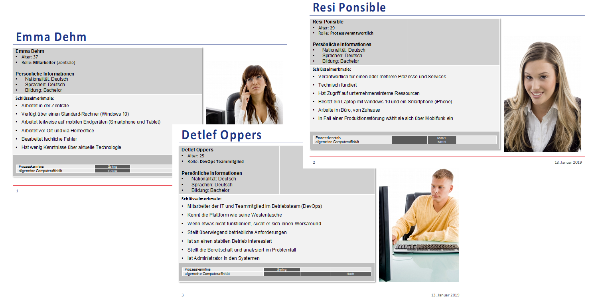
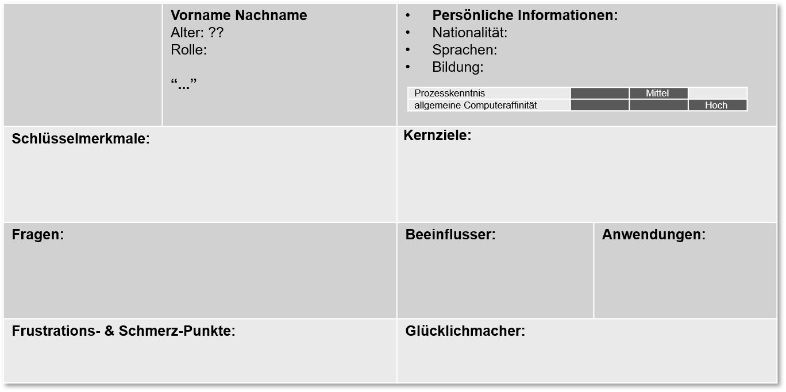
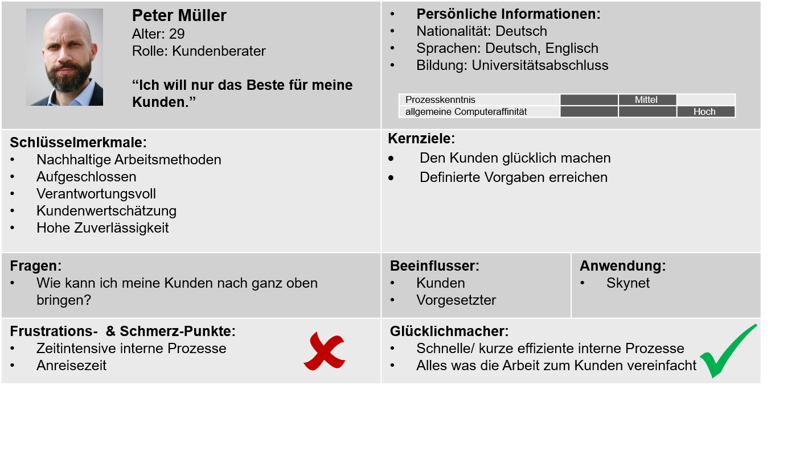

# Scrum

In Wirklichkeit...

* Sind Anforderungen schwer abzuschätzen
* Ändern sich Anforderungen fortwährend
* Ändern sich Anforderungen (zu) spät im Projekt
* Ist die Kommunikation mit dem Auftraggeber bzw. Kunden schwer

Daher ist ein Vorgehensmodell für die Software-Entwicklung erforderlich, dass es uns erlaubt mit sich ständig ändernden Parametern in Projekten umzugehen...

## Woher stammt Scrum?

First Things First: Scrum ist kein Acronym

> A scrummage, commonly known simply as a scrum, is a method of restarting play in [rugby football](https://en.wikipedia.org/wiki/Rugby\_football) that involves players packing closely together with their heads down and attempting to gain possession of the ball \[_Scrum_, abbreviated form of _scrummage_, [_Oxford English Dictionary Online_](http://www.oed.com/)]

<figure><figcaption>
[2]
</figcaption></figure>

### The New New Product Development Game

The New New Product Development Game, Hirotaka Takeuchi and Ikujiro Nonaka, Harvard Business Review, 1986 \[1]

<figure><figcaption>
Bildquelle: Charles Lanteigne -, CC BY-SA 3.0, <a href="https://commons.wikimedia.org/w/index.php?curid=23915880">https://commons.wikimedia.org/w/index.php?curid=23915880</a> [2] Catherine Trigg - <a href="https://www.flickr.com/photos/cjtrigg/261317878/">https://www.flickr.com/photos/cjtrigg/261317878/</a>, CC BY 2.0
</figcaption></figure>

Bei der Entwicklung der Entwicklung der Canon AE-1 (Canon, 1976) wurde die Idee des Scrum das erste Mal eingeführt ([https://hbsp.harvard.edu/product/86116-PDF-ENG](https://hbsp.harvard.edu/product/86116-PDF-ENG)).

Erfolgsfaktoren für die Umsetzung waren u.a.

* Cross-Functional Teams
* Selbstorganisierende Teams
* Autonome Teams

## Agiles Manifest

Das **Agile Manifest** wurde im **Februar 2001** von einer Gruppe von 17 Softwareentwicklern in Utah verfasst, um leichtgewichtige Entwicklungsmethoden für agiles Projektmanagement festzulegen.

**Individuen und Interaktionen** mehr als Prozesse und Werkzeuge\
**Funktionierende Software** mehr als umfassende Dokumentation\
**Zusammenarbeit mit dem Kunden** mehr als Vertragsverhandlung\
**Reagieren auf Veränderung** mehr als das Befolgen eines Plans

> Das heißt, obwohl wir die Werte auf der rechten Seite wichtig finden, schätzen wir die Werte auf der linken Seite höher ein.&#x20;

[http://agilemanifesto.org/](http://agilemanifesto.org/)&#x20;

### 12 Prinzipien

1. Unsere höchste Priorität ist es, den Kunden durch **frühe und kontinuierliche Auslieferung** wertvoller Software zufrieden zu stellen.
2. Heise Anforderungsänderungen selbst spät in der Entwicklung willkommen. Agile Prozesse nutzen **Veränderungen zum Wettbewerbsvorteil des Kunden**.
3. Liefere **funktionierende Software regelmäßig** innerhalb weniger Wochen oder Monate und bevorzuge dabei die kürzere Zeitspanne.
4. **Fachexperten und Entwickler** müssen während des Projektes **täglich zusammenarbeiten**.
5. Errichte Projekte rund um **motivierte Individuen**. Gib ihnen das Umfeld und die Unterstützung, die sie benötigen und **vertraue** darauf, dass sie die Aufgabe erledigen.
6. Die effizienteste und effektivste Methode, Informationen an und innerhalb eines Entwicklungsteams zu übermitteln, ist im **Gespräch von Angesicht zu Angesicht**.
7. **Funktionierende Software** ist das wichtigste Fortschrittsmaß.
8. Agile Prozesse fördern nachhaltige Entwicklung. Die Auftraggeber, Entwickler und Benutzer sollten ein **gleichmäßiges Tempo** auf **unbegrenzte Zeit** halten können.
9. Ständiges Augenmerk auf **technische Exzellenz** und gutes Design fördert Agilität.
10. **Einfachheit** - die Kunst, die Menge nicht getaner Arbeit zu maximieren - ist essenziell.
11. Die besten Architekturen, Anforderungen und Entwürfe entstehen durch **selbstorganisierte Teams**.
12. In regelmäßigen Abständen **reflektiert** das Team, wie es effektiver werden kann und passt sein Verhalten entsprechend an.

### Der Der Scrum Prozess im Detail

<figure><figcaption>
Angelehnt an B. Gloger
</figcaption></figure>

### Scrum Rollen

**Product Owner**

* Verantwortlich für »Business Value«, setzt die Prioritäten für höchstmöglichen ROI
* Traditionell: Projektmanager, der die Arbeit kontrolliert

**Team**

* Verantwortlich für das kontinuierliches Ausliefern von Arbeitsergebnissen/Teilergebnissen
* Traditionell: Bekommt Arbeitsanweisungen vom Projektmanager

**ScrumMaster**

* Achtet auf das Einhalten des Scrum-Prozesses und hält Störungen vom Team fern
* Traditionell: kein Äquivalent

**Hinweis:** Ein agiler Coach ersetzt keinen ScrumMaster

### Einfache Berechnung des Release-Termins

<figure><figcaption></figcaption></figure>

### Neuberechnung bei Änderung des Umfangs

<figure><figcaption></figcaption></figure>

* Zusätzliche Anforderungen haben **immer** einen neuen Release-Termin zur Folge
* Soll der ursprüngliche Termin gehalten werden müssen, sind die am niedrigsten priorisierten Anforderungen zu streichen
* Die Neupriorisierung bzw. Neuordnung von Anforderungen hat keine Auswirkungen auf den Release-Plan

## Sprint-Planung - Planning 1

* Sprint-Planung legt Arbeitsvorrat für kommende Iteration (Sprint) fest
* Reihenfolge wird durch Product Owner vorgegeben (Priorisierung)
* Die Menge der Aufgaben wird durch das Team festgelegt (Pull Prinzip)
  * Erfahrungswerte
  * Empirische Daten
  * Kann auch mal daneben gehen
* Eventuell wir Zeit für Refactoring, Schulungen etc. eingeplant
* Ergebnis der Sprintplanung ist das Sprint Backlog + Sprint Ziel
* Commitment durch das Team? Seit 2011 kein Bestandteil des Scrum Guide mehr. \[[https://www.scrum.org/resources/commitment-vs-forecast ](https://www.scrum.org/resources/commitment-vs-forecast)]

## Sprint-Planung - Planning 2

* Es ist Aufgabe des Teams, wie die Funktionalität geliefert werden kann
* Planning 2 ist eine Arbeitssitzung in der das Design, die Spezifikation und die Architektur erarbeitet werden
* Verständnis wie Ziel gemeinsam bewältigt werden kann
* Ergebnis des Planning 2 sind Aufgaben (engl. tasks)
  * Praxistipp: Jeder Task sollte einen maximalen Umfang von maximal 8 Stunden (≈ 1 Personentag) haben

## Schätzen

* Schätzen ist eine der schwersten Aufgaben im Prozess
* Unterscheidung
  * Schätzen von Komplexität
  * Schätzen von Aufwand/Dauer
* Keine Korrelation zwischen Aufgabengröße und wie lange ein Entwickler dafür benötigt
  * Produktivitätsunterschied zwischen Entwicklern bis Faktor 25
* Schätzen auf Basis von Story Punkten (engl. Story Points)
  * Planning Poker
  * Magic Estimation
  * ...

## Personas

* In der agilen Welt werden oftmals »Stories« verwendet
  * Basierend auf Mike Cohen (User Stories Applied, 2004)
* Warum Personas?
  * Stellvertretend für eine spezielle Benutzerrolle (engl. user role)
  * Archetyp eines typischen Anwenders
  * Fiktive Person, die eine Gruppe von Anwender repräsentiert
  * Hilft den Anwender besser zu verstehen

<figure><figcaption></figcaption></figure>

<figure><figcaption></figcaption></figure>

<figure><figcaption></figcaption></figure>

### Weiterführende Literatur&#x20;

**Scrum – Produkte zuverlässig und schnell entwickeln** Boris Gloger, Hanser Verlag, 5. Auflage, 2016, ISBN 978-3-446-44723-3

\

